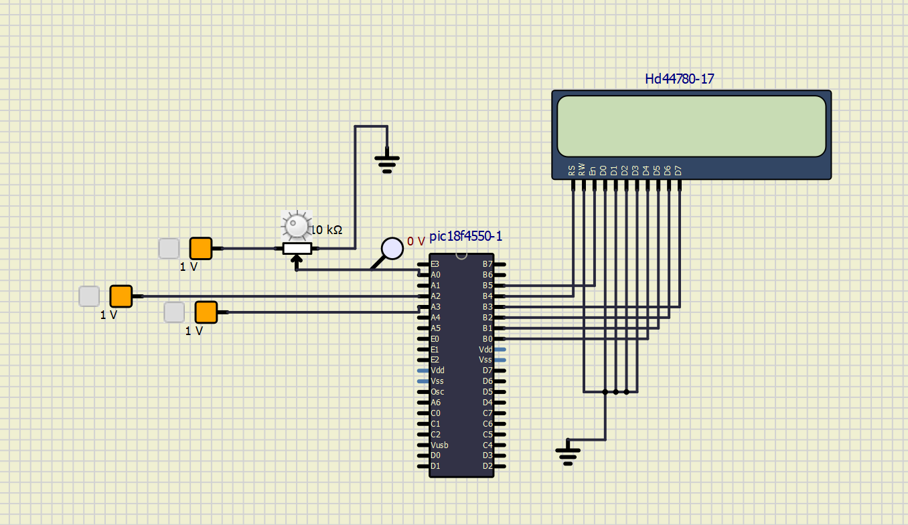

## Projeto 3 - Termômetro Digital com LM35 e Conversor A/D <br> <br> Jean Carlos Pereira Cassiano - NUSP: 13864008 <br> Giovanna de Freitas Velasco - NUSP: 13676346

### Introdução

O presente projeto contém o código em Linguagem C de um Termômetro Digital para o microcontrolador PIC18F4550. O funcionamento do termômetro baseia-se na leitura da temperatura por meio do sensor LM35, que fornece uma tensão analógica proporcional à temperatura em graus Celsius. O módulo ADC do PIC18F4550 converte esta tensão em um valor digital, que é exibido em um display LCD 16x2.

Neste projeto, a configuração do ADC é realizada com tensões de referência externas conectadas aos pinos AN2 e AN3, o que garante maior precisão nas leituras de temperatura. Além disso, a variação da tensão fornecida pelo LM35 é simulada no SimulIDE por meio de um potenciômetro, que permite a simulação da temperatura de 0 a 100 °C.

O display LCD é configurado para operar no modo 4 bits, otimizando o uso das portas digitais do microcontrolador. A frequência do clock é de 8 MHz, e todas as configurações necessárias para o funcionamento correto do sistema estão detalhadas no código e na simulação. Os conceitos envolvidos no desenvolvimento do código e da simulação são explicados a seguir.

### Conceitos Envolvidos

#### Conversor Analógico-Digital (ADC)

Neste projeto, fizemos uso do módulo ADC do PIC18F4550 para realizar a conversão da tensão analógica fornecida pelo sensor LM35 em um valor digital. O LM35 é um sensor de temperatura linear que gera uma tensão de 10 mV para cada grau Celsius, o que significa que 1V representa 100°C. Para obter uma leitura precisa da temperatura, o ADC é configurado para usar uma referência de tensão externa de 1V nos pinos AN2 e AN3, ajustando o registrador ADCON1 da seguinte forma:

``` C
    // Configuração do ADC para usar referências externas
    ADCON1 = 0b00001110;  // AN2 como Vref+ e AN3 como Vref-
    ADC_Init();           // Inicializa o módulo ADC
```

A configuração do ADC é importante para garantir que o valor digital lido pelo microcontrolador represente com precisão a temperatura medida pelo LM35. O ADC tem uma resolução de 10 bits, permitindo quantizar a faixa de 0 a 1V em 1024 níveis distintos.

#### Alimentação Externa de Referência (Vref)

Para melhorar a precisão das leituras, utilizamos uma alimentação externa de 1V como Vref+ e GND como Vref-. Isso garante que a sensibilidade do conversor A/D esteja ajustada à faixa de operação do LM35 (0-100°C). A escolha da referência de 1V, em vez de 5V, aumenta a precisão da conversão para aplicações sensíveis.

#### Interface com o Display LCD

O display LCD 16x2 é utilizado para exibir a temperatura em graus Celsius com uma casa decimal de precisão. O LCD é configurado no modo de 4 bits para otimizar o uso das portas do microcontrolador. As conexões para o display são feitas da seguinte maneira:

* D4: RB0
* D5: RB1
* D6: RB2
* D7: RB3
* RS: RB4
* E: RB5

As conexões podem ser visualizadas à seguir no SimulIDE:



A inicialização do display e o envio de dados são realizados com as funções fornecidas pela biblioteca do MikroC:

``` C
    Lcd_Init();           // Inicializa o LCD
    Lcd_Cmd(_LCD_CLEAR);  // Limpa o display
    Lcd_Cmd(_LCD_CURSOR_OFF);  // Desliga o cursor
``` 

O display exibe a temperatura formatada como "XX.XX °C", garantindo que o usuário possa monitorar a temperatura com precisão.

### Análise das Funções do Código

#### void main()
A função `main` realiza as configurações e a execução principal do código, organizando as tarefas da seguinte forma:

1. **Configuração do ADC**: A configuração do registrador `ADCON1` define os pinos AN2 e AN3 como referências externas para o ADC, garantindo leituras precisas da tensão analógica.
   - `ADC_Init()` inicializa o módulo ADC, preparando o microcontrolador para realizar conversões de sinais analógicos.

2. **Configuração do LCD**:
   - `Lcd_Init()` inicializa o display LCD.
   - `Lcd_Cmd(_LCD_CLEAR)` limpa o display para garantir que não haja resíduos de informações anteriores.
   - `Lcd_Cmd(_LCD_CURSOR_OFF)` desativa o cursor, deixando a tela mais limpa.
   - `Lcd_Out(1, 1, " Temp:")` exibe a mensagem "Temp:" no display para indicar que o valor a seguir é uma temperatura.

3. **Loop Infinito**: O programa entra em um loop infinito para ler continuamente a temperatura e exibi-la no LCD.
   - `ADC_Get_Sample(0)` realiza a leitura do valor analógico no pino AN0 (RA0), onde o LM35 está conectado.
   - A tensão lida é convertida em temperatura (em °C) usando a fórmula: `(adcValue * 5.0 / 1023.0) * 100.0`, que considera a sensibilidade do LM35 de 10 mV/°C.
   - `FloatToStr(temperature, text)` converte o valor de temperatura em uma string. O caractere `'\0'` é usado para limitar o tamanho da string.
   - `Lcd_Out(1, 6, text)` exibe o valor da temperatura no display.
   - `Lcd_Chr(1, 12, 223)` exibe o símbolo de grau (°) na posição correta.
   - `Lcd_Out(1, 13, "C")` adiciona o "C" de Celsius ao lado do valor de temperatura.
   - `Delay_ms(500)` pausa o programa por 500 ms antes de realizar a próxima leitura.

#### Pinos de Comunicação com o LCD
Os pinos para comunicação com o display LCD são definidos no início do código usando `sbit`:

- **Pinos de Dados**: 
  - `LCD_D4` a `LCD_D7` estão conectados aos pinos `LATB0_bit` a `LATB3_bit` do PIC18F4550.
- **Pinos de Controle**:
  - `LCD_RS` e `LCD_EN` estão conectados aos pinos `LATB4_bit` e `LATB5_bit`, respectivamente.
- **Direção do Fluxo de Dados**:
  - `LCD_RS_Direction`, `LCD_EN_Direction`, `LCD_D4_Direction`, `LCD_D5_Direction`, `LCD_D6_Direction`, `LCD_D7_Direction` configuram os pinos como saídas, garantindo que o microcontrolador possa controlar o display.


### Vídeo demonstrativo


[Assista ao vídeo demonstrativo](./Simulacao.mp4)


### Conclusão

O projeto foi concluído com êxito: pelo vídeo demonstrativo, percebemos que a leitura da temperatura pelo sensor LM35 e a exibição precisa no display LCD funcionam como esperado. A variação da tensão simulada no SimulIDE reflete corretamente as mudanças de temperatura, e o uso das referências externas de 1V contribuiu para uma maior precisão nas leituras do ADC.


