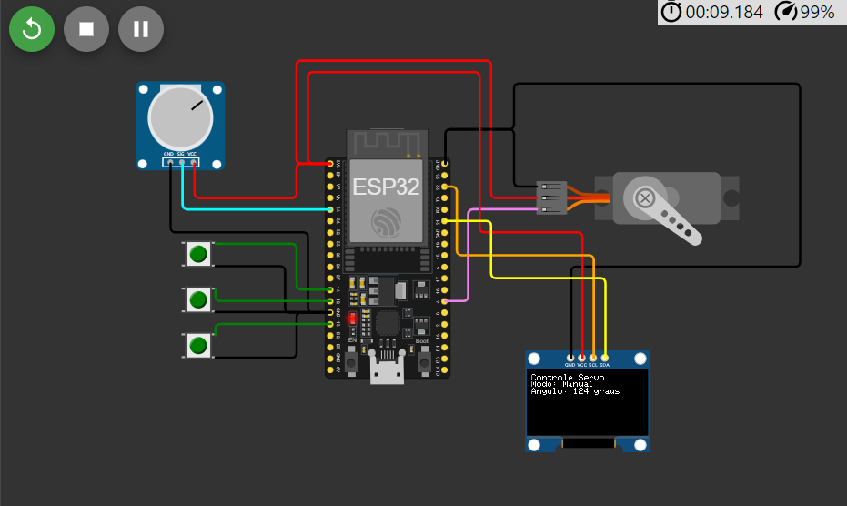
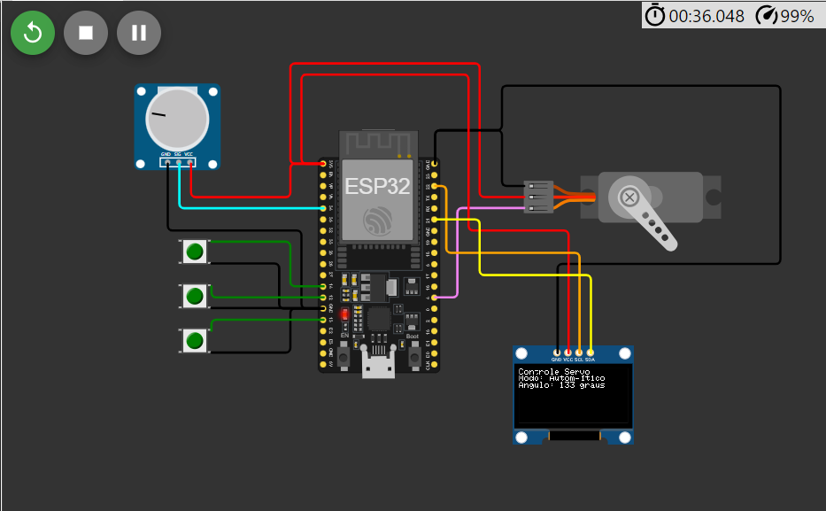
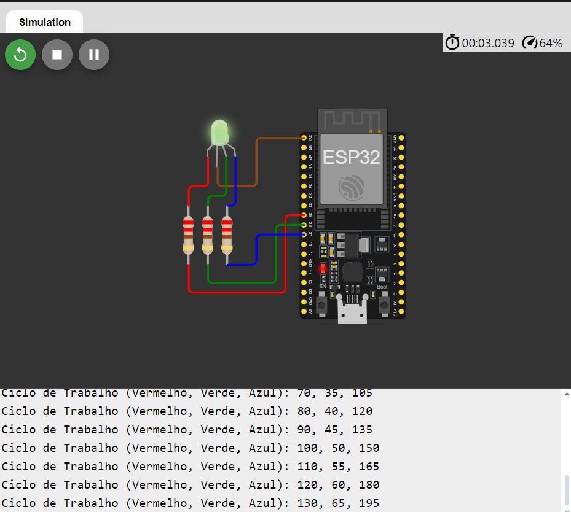

# Projeto 4 - Microcontroladores ESP32 <br> <br> Jean Carlos Pereira Cassiano - NUSP: 13864008 <br> Giovanna de Freitas Velasco - NUSP: 13676346


## Descrição

Este projeto é dividido em duas partes principais, cada uma focada em diferentes funcionalidades de microcontroladores ESP32 com ênfase em controle PWM e comunicação serial.

## Estrutura do Diretório

O repositório está organizado em duas pastas principais, cada uma contendo arquivos específicos para os programas desenvolvidos:

```bash
Projeto
│
├── Programa 1
│   ├── diagram.json       # Diagrama do circuito utilizado
│   ├── libraries.txt      # Bibliotecas para o projeto
│   ├── sketch.ino         # Código-fonte
│   └── workwi.txt         # Link da Simulação no Workwi
│
└── Programa 2
    ├── diagram.json       # Diagrama do circuito utilizado
    ├── sketch.ino         # Código-fonte
    └── workwi.txt         # Link da Simulação no Workwi
```

## Tecnologias Utilizadas

- Arduino IDE: Ambiente de desenvolvimento para a programação do ESP32.
- Wokwi: Plataforma online para simulação de circuitos eletrônicos.

## Carregamento e Execução

Para simular os programas, abra o respectivo arquivo workwi e entre no link no txt. Lá você poderá testar ambas as simulações.


## Programa 1



Acima pode-se visualizar o primeiro programa em desenvolvimento. Nesse estado o motor se encontra no estado manual onde podemos controla-lo.


Acima, temos o estado Parado, onde o motor não se move independente do que fazemos. 




Por fim, temos o estado automático, onde o motor gira automaticamente em sentido anti-horário.

## Programa 2



Referente ao programa 2, aqui temos o funcionamento dele, onde as cores do LED vão se alternando e temos os prints dos códigos de cores aparecendo no terminal.